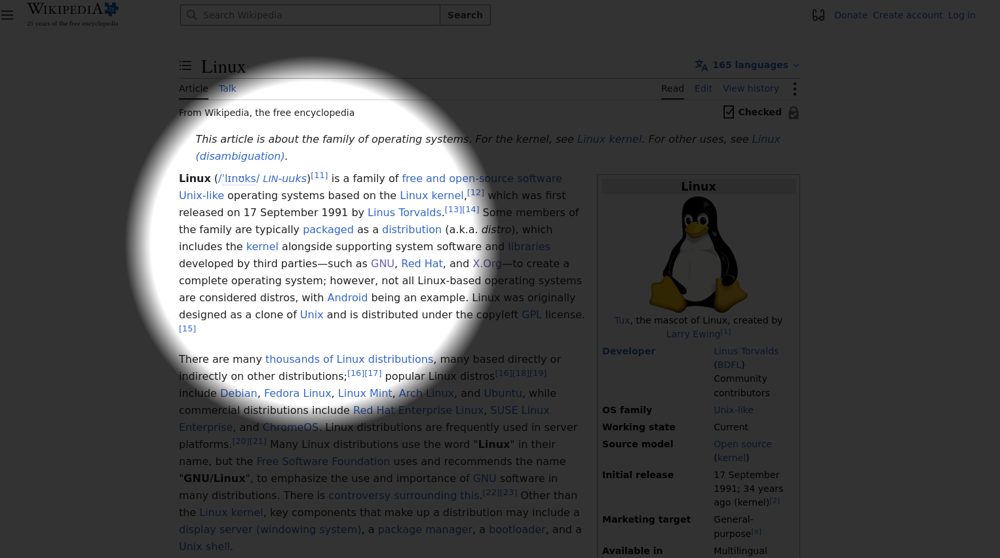

# Cursor Beacon
Cursor Beacon puts a soft spotlight around your mouse cursor and dims the rest of the page — perfect for presentations, screencasts, or tutorials. Adjust the spotlight radius and darkness, toggle instantly with Ctrl+Shift+U, and exclude specific sites via the blacklist.

